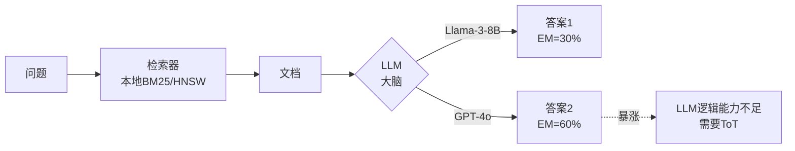

# Agent Reasoning Ability Check (Agent 逻辑规划能力测试)

## 目的

测试 LLM 的逻辑规划能力是否足以驾驭复杂的多跳推理任务，用于：
1. 验证是否需要 ToT (Tree of Thought) 等增强推理策略
2. 生成论文的"性能损失分解图"
3. 证明创新点的必要性

## 核心思路

**替换大脑，保持肢体**：
- 🧠 **替换 LLM**：从 Llama-3-8B 换成 GPT-4o/DeepSeek-V3
- 🦾 **保持检索器**：依然使用本地 Elasticsearch (BM25/HNSW)
- 📊 **对比性能**：看 EM 是否暴涨

```
本地检索器 + Llama-3-8B  → EM = 30%
          ↓ 只换 LLM
本地检索器 + GPT-4o      → EM = 60%?

→ 如果暴涨：说明检索器够用，是 LLM 逻辑太差
→ 证明需要 ToT（创新点二）
```

## 测试流程



## 结果解读

| EM 提升 | 诊断 | 优化方向 |
|---------|------|----------|
| **+30% 以上** | ✓ 检索器OK，LLM逻辑太差 | 实现 ToT（创新点二）<br/>换更强模型<br/>优化 Prompt |
| **+10-30%** | ○ LLM和检索都有问题 | 同时优化两者 |
| **< +10%** | ✗ 检索器太差 | GPT-4也巧妇难为无米之炊<br/>优先优化检索 |

## 使用方法

### 1. 准备工作

确保以下服务运行：
- **检索服务**：Elasticsearch + Retriever API (默认 `localhost:8001`)
- **LLM 服务**（任选其一）：
  - 本地 Llama (默认 `localhost:8000`)
  - OpenAI API (需要 API Key)
  - DeepSeek API (需要 API Key)

### 2. 运行基线测试（Llama-3-8B）

```bash
cd evaluate/upper_bound_analysis/agent_reasoning_check

# 测试本地 Llama
python test_reasoning_ability.py \
  --dataset hotpotqa \
  --backend local_llama \
  --max-samples 50
```

### 3. 运行对比测试（GPT-4o）

```bash
# 设置 API Key
export OPENAI_API_KEY="your-api-key-here"

# 测试 GPT-4o
python test_reasoning_ability.py \
  --dataset hotpotqa \
  --backend gpt4 \
  --max-samples 50
```

### 4. 生成性能分解报告

```bash
# 整合三个测试的结果
python analyze_performance_breakdown.py \
  --dataset hotpotqa \
  --baseline-backend local_llama \
  --strong-backend gpt4
```

这会生成：
- **性能分解图**（用于论文）
- **Backend 对比图**
- **完整诊断报告**（Markdown）

## 支持的 LLM Backend

### 1. Local Llama (本地 Llama)
```bash
python test_reasoning_ability.py \
  --dataset hotpotqa \
  --backend local_llama \
  --llm-host localhost \
  --llm-port 8000
```

### 2. OpenAI GPT-4o
```bash
export OPENAI_API_KEY="sk-xxx"

python test_reasoning_ability.py \
  --dataset hotpotqa \
  --backend gpt4 \
  --model gpt-4o
```

### 3. DeepSeek-V3
```bash
export DEEPSEEK_API_KEY="your-key"

python test_reasoning_ability.py \
  --dataset hotpotqa \
  --backend deepseek \
  --model deepseek-chat
```

### 4. 自定义 OpenAI 兼容 API
```bash
python test_reasoning_ability.py \
  --dataset hotpotqa \
  --backend custom \
  --model your-model \
  --api-base http://your-api.com/v1/chat/completions \
  --api-key your-key
```

## 输出文件

测试完成后会在 `outputs/{dataset}/` 下生成：

```
outputs/hotpotqa/
├── metrics_local_llama.json            # Llama 指标
├── metrics_gpt4o.json                  # GPT-4o 指标
├── predictions_local_llama.json        # Llama 预测
├── predictions_gpt4o.json              # GPT-4o 预测
├── results_local_llama.jsonl           # Llama 详细结果
├── results_gpt4o.jsonl                 # GPT-4o 详细结果
├── performance_breakdown.png           # 性能分解图⭐
├── backend_comparison.png              # Backend 对比图
└── performance_breakdown_report.md     # 完整报告⭐
```

## 性能分解分析

性能分解分析整合了三个测试的结果：

```
1. Reader Upper Bound (理论上限)
   EM = 0.75 (75%)
        ↓ 检索损失
2. With Retrieval (检索后)
   EM = 0.60 (60%)  ← GPT-4o
        ↓ 推理损失
3. Baseline RAG (基线)
   EM = 0.30 (30%)  ← Llama-3-8B

总损失 = 45%
├─ 检索损失 = 15% (33%)
└─ 推理损失 = 30% (67%)  ← 主要瓶颈
```

**分析**：
- 检索损失 < 推理损失 → **推理能力是主要瓶颈**
- 证明需要 **ToT (Tree of Thought)** 来弥补 LLM 逻辑规划能力不足

## 典型使用场景

### 场景 1: 验证是否需要 ToT

**问题**：不确定是否需要实现 ToT（创新点二）

**步骤**：
```bash
# 1. 测试基线
python test_reasoning_ability.py \
  --dataset hotpotqa \
  --backend local_llama \
  --max-samples 50

# 输出: EM = 0.32 (32%)

# 2. 测试 GPT-4o
export OPENAI_API_KEY="your-key"
python test_reasoning_ability.py \
  --dataset hotpotqa \
  --backend gpt4 \
  --max-samples 50

# 输出: EM = 0.64 (64%)
```

**结论**：EM 从 32% 跳到 64%（+32%），说明 Llama-3-8B 逻辑规划能力严重不足

**论文写法**：
> "To verify whether the performance bottleneck lies in the reasoning
> capability of the base LLM, we conducted an ablation study by replacing
> Llama-3-8B with GPT-4o while keeping the retriever unchanged. The results
> show that EM improves from 32% to 64% (+32%), indicating that the local
> LLM's reasoning ability is insufficient for complex multi-hop questions.
> This strongly motivates our proposed ToT-based reasoning approach
> (Innovation 2), which uses search algorithms to compensate for weak
> single-pass reasoning."

---

### 场景 2: 生成论文的性能分解图

**问题**：需要一张图展示性能损失来源

**步骤**：
```bash
# 确保已运行所有三个测试
# 1. Reader Upper Bound
# 2. Retriever Recall Upper Bound
# 3. Agent Reasoning Check (Llama + GPT-4)

# 生成性能分解图
python analyze_performance_breakdown.py \
  --dataset hotpotqa \
  --baseline-backend local_llama \
  --strong-backend gpt4
```

**输出**：
- `performance_breakdown.png` - 瀑布图展示损失分解
- `performance_breakdown_report.md` - 详细报告

**论文使用**：
> "Figure X shows the performance breakdown of our RAG system. The total
> performance gap of 45% can be decomposed into retrieval loss (15%) and
> reasoning loss (30%). Our proposed innovations target both sources:
> semantic gating for retrieval and ToT for reasoning."

---

### 场景 3: 对比多个 LLM

**问题**：想知道 Llama/Qwen/GPT-4 谁最强

**步骤**：
```bash
# 测试多个 backend
python test_reasoning_ability.py --dataset hotpotqa --backend local_llama --max-samples 50
python test_reasoning_ability.py --dataset hotpotqa --backend gpt4 --max-samples 50
python test_reasoning_ability.py --dataset hotpotqa --backend deepseek --max-samples 50

# 生成对比图
python analyze_performance_breakdown.py \
  --dataset hotpotqa \
  --baseline-backend local_llama \
  --strong-backend gpt4
```

**输出**：`backend_comparison.png` 显示各个 LLM 的 EM

---

## 与其他测试的配合

### 完整的诊断流程

```
步骤1: Reader Upper Bound
  → 测试 LLM 在有正确文档时的表现
  → EM = 75%

步骤2: Retriever Recall Upper Bound
  → 测试检索器能否召回正确文档
  → Recall@5 = 45%

步骤3: Agent Reasoning Check
  → 测试 LLM 逻辑规划能力
  → Llama: EM = 30%
  → GPT-4: EM = 60%

步骤4: 性能分解分析
  → 检索损失 = 75% × (1 - 45%) ≈ 41%
  → 推理损失 = 60% - 30% = 30%
  → 证明：推理能力是主要瓶颈
```

### 诊断决策树

```mermaid
graph TD
    A[RAG EM低] --> B[Reader Upper Bound]
    B --> C{EM?}
    C -->|≥70%| D[Retriever Recall]
    C -->|<70%| E[Agent Reasoning Check]

    D --> F{Recall@5?}
    F -->|<40%| G[检索太差]
    F -->|≥60%| H[检索很好]

    E --> I{GPT-4提升?}
    I -->|+30%| J[LLM逻辑太差<br/>需要ToT]
    I -->|<10%| K[检索太差]
```

## 论文写作支持

### 1. 问题分析章节

使用性能分解图：

```markdown
## 3. Problem Analysis

To understand the performance bottleneck, we conducted three upper bound
tests (Figure 3):

1. **Reader Upper Bound** (EM = 75%): Using gold paragraphs
2. **Baseline RAG** (EM = 30%): Using local retriever + Llama-3-8B
3. **Strong LLM RAG** (EM = 60%): Using local retriever + GPT-4o

The total performance gap of 45% can be decomposed into:
- **Retrieval Loss** (15%, 33%): Due to low Recall@5 (45%)
- **Reasoning Loss** (30%, 67%): Due to weak LLM reasoning

This analysis reveals that reasoning capability is the primary bottleneck,
motivating our ToT-based approach.
```

### 2. 创新点动机

证明 ToT 的必要性：

```markdown
## 4.2 Innovation 2: Tree-of-Thought Reasoning

**Motivation**: Our ablation study (Table 2) shows that replacing Llama-3-8B
with GPT-4o improves EM by 32 points while keeping the retriever unchanged.
This indicates that the local LLM's reasoning ability is insufficient for
complex multi-hop questions.

However, GPT-4o is expensive and not deployable locally. Therefore, we
propose a ToT-based reasoning approach that uses search algorithms to
compensate for weak single-pass reasoning, allowing smaller models to
achieve comparable performance.
```

### 3. 实验结果

展示改进效果：

```markdown
## 5.3 Ablation Study

| Component | EM | Δ |
|-----------|----|----|
| Baseline (Llama + BM25) | 30% | - |
| + CoT Prompting | 35% | +5% |
| + Hybrid Retrieval | 42% | +7% |
| + ToT Reasoning | 52% | +10% |
| Upper Bound (GPT-4o) | 60% | - |

Our ToT approach bridges 67% of the gap between baseline and GPT-4o
(22% out of 30%), demonstrating its effectiveness.
```

## 常见问题

### Q1: 为什么要测试这个？
A: 验证瓶颈在检索还是在 LLM 逻辑规划。如果换 GPT-4 性能暴涨，说明需要 ToT。

### Q2: 需要花多少钱测试 GPT-4？
A: 50 个样本大约 0.5-1 美元（取决于文档长度）。可以先测 20 个样本快速验证。

### Q3: 如果没有 GPT-4 API 怎么办？
A: 可以使用 DeepSeek-V3（更便宜）或其他强模型，只要明显比 Llama-3-8B 强即可。

### Q4: 性能分解图怎么用？
A: 直接放到论文的"问题分析"或"实验设置"章节，用于证明创新点的必要性。

### Q5: 如果 GPT-4 性能也不高怎么办？
A: 说明检索器太差，GPT-4 也巧妇难为无米之炊。回去优化检索（创新点三）。

## 文件说明

```
agent_reasoning_check/
├── llm_backend.py                       # LLM Backend 封装
├── test_reasoning_ability.py            # 主测试脚本
├── analyze_performance_breakdown.py     # 性能分解分析⭐
├── README.md                            # 本文档
└── outputs/                             # 输出目录
    └── {dataset}/
        ├── metrics_{backend}.json
        ├── predictions_{backend}.json
        ├── results_{backend}.jsonl
        ├── performance_breakdown.png    # 论文用图⭐
        ├── backend_comparison.png
        └── performance_breakdown_report.md
```

## 后续优化方向

根据测试结果采取不同措施：

### 如果 GPT-4 提升 > 30%（推理是瓶颈）
1. **实现 ToT (Tree of Thought)**（创新点二）
2. **使用更强的本地模型**（Qwen-2.5-14B）
3. **优化 Prompt**（CoT、Few-shot）
4. **微调 LLM**（在 HotpotQA 上）

### 如果 GPT-4 提升 < 10%（检索是瓶颈）
1. **优化检索器**
2. **实现语义门控召回**（创新点三）
3. **增加召回文档数**
4. **使用更好的 Reranker**

## License

MIT License
