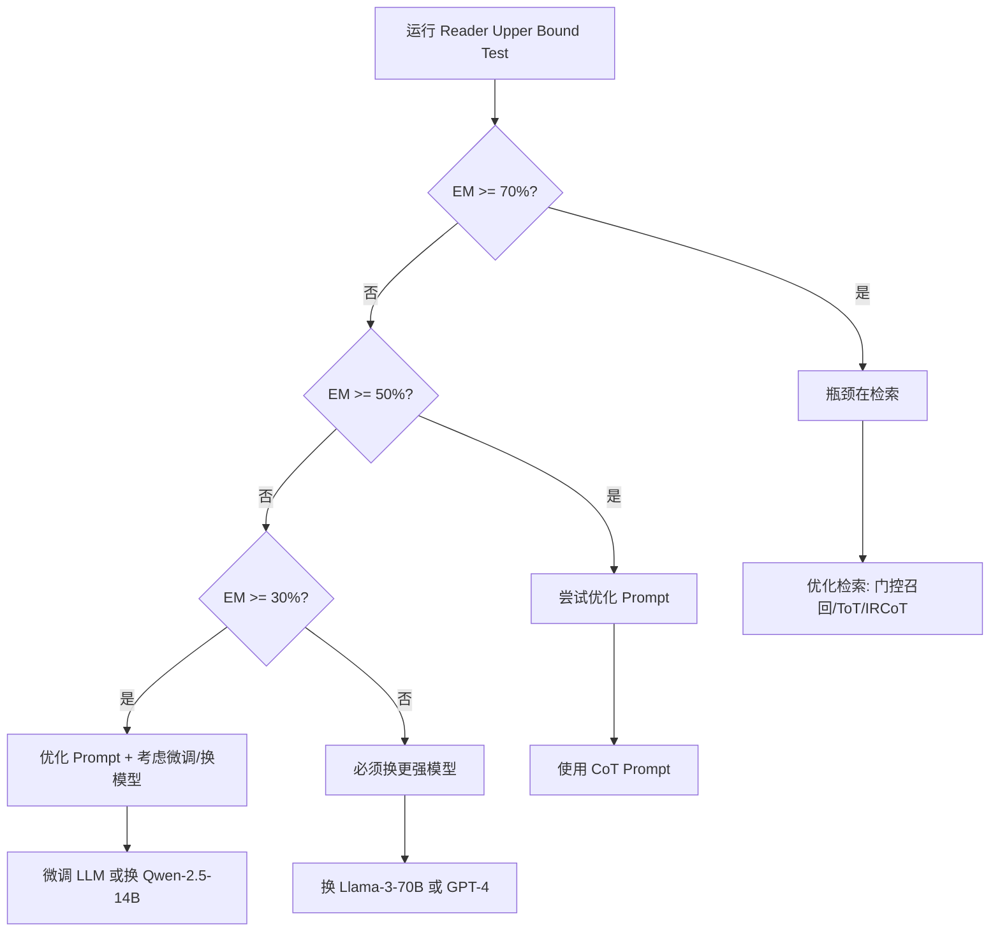

# Reader Upper Bound Test (阅读理解上限测试)

## 目的

测试 LLM 在**"已知答案就在文中"**的情况下能否答对，用于诊断 RAG 系统的瓶颈究竟在检索还是在 LLM/Prompt。

## 核心思路

在 RAG 系统中，性能不佳可能有两个原因：
1. **检索问题**：没有检索到正确的文档
2. **LLM/Prompt 问题**：即使给了正确文档，LLM 也答不对

本测试通过给 LLM 提供数据集自带的 **Gold Paragraphs**（专家标注的支撑文档），绕过检索环节，直接测试 LLM 的阅读理解能力上限。

## 测试流程

```
数据集 Gold Paragraphs → LLM → 答案 → 计算 EM/F1
                ↑
            不经过检索！
```

## 结果解读

| EM 分数 | 诊断 | 优化方向 |
|---------|------|----------|
| **EM ≥ 70%** | ✓ LLM 能力优秀，瓶颈在检索 | 优化检索策略（门控召回、ToT、IRCoT）<br>提升召回率（增加 top_k、混合检索、Reranker） |
| **50% ≤ EM < 70%** | ○ LLM 有一定能力，仍有提升空间 | 先优化 Prompt（CoT、Few-shot）<br>再优化检索 |
| **30% ≤ EM < 50%** | △ LLM 能力较弱 | 优先优化 Prompt/微调 LLM<br>考虑换更强模型 |
| **EM < 30%** | ✗ LLM 能力严重不足 | 必须换更强模型<br>优化检索毫无意义 |

## 使用方法

### 1. 运行测试

**基本用法：**
```bash
cd evaluate/reader_upper_bound

# 测试单个数据集
python test_reader_upperbound.py --datasets musique

# 测试多个数据集
python test_reader_upperbound.py --datasets musique 2wikimultihopqa hotpotqa

# 快速测试（只测试 100 个样本）
python test_reader_upperbound.py --datasets musique --max-samples 100
```

**指定 Prompt 风格：**
```bash
# Standard Prompt（默认）
python test_reader_upperbound.py --datasets musique --prompt-style standard

# Chain-of-Thought Prompt
python test_reader_upperbound.py --datasets musique --prompt-style cot

# Structured Prompt
python test_reader_upperbound.py --datasets musique --prompt-style structured
```

**完整参数：**
```bash
python test_reader_upperbound.py \
  --datasets musique 2wikimultihopqa \
  --llm-host localhost \
  --llm-port 8000 \
  --data-dir processed_data \
  --output-dir evaluate/reader_upper_bound/outputs \
  --max-samples 100 \
  --prompt-style cot
```

### 2. 分析结果

**生成诊断报告：**
```bash
# 分析单个数据集的结果
python analyze_results.py --dataset musique --prompt-style standard

# 比较不同 Prompt 风格的效果
python analyze_results.py --dataset musique --compare-prompts
```

### 3. 查看输出文件

测试完成后，会在 `outputs/{dataset_name}/` 下生成以下文件：

```
outputs/
├── musique/
│   ├── metrics_standard.json          # 评估指标
│   ├── results_standard.jsonl         # 详细结果（每个问题）
│   ├── error_cases_standard.jsonl     # 错误案例
│   └── diagnosis_report_standard.md   # 诊断报告
├── 2wikimultihopqa/
│   └── ...
└── summary_standard.json              # 总体汇总
```

## Prompt 风格说明

### Standard Prompt
简洁明了的指令，直接要求从文档中提取答案。

**适用场景：**
- 基线测试
- 模型本身已经很强

### Chain-of-Thought (CoT) Prompt
引导模型分步思考：定位文档 → 提取信息 → 给出答案。

**适用场景：**
- 模型在 Standard Prompt 下表现不佳
- 需要推理的复杂问题

**示例：**
```
Think step by step:
Step 1 - Relevant documents: ...
Step 2 - Key information: ...
Step 3 - Final answer: ...
```

### Structured Prompt
结构化的指令格式，明确输出要求。

**适用场景：**
- 模型输出格式不稳定
- 需要严格控制输出

## 实验建议

### 推荐的测试顺序

1. **第一步：基线测试**
   ```bash
   python test_reader_upperbound.py --datasets musique --max-samples 100 --prompt-style standard
   ```
   快速测试，看看基本水平。

2. **第二步：完整测试**
   ```bash
   python test_reader_upperbound.py --datasets musique 2wikimultihopqa
   ```
   在完整数据集上测试。

3. **第三步：尝试不同 Prompt**
   如果 EM < 50%，尝试 CoT：
   ```bash
   python test_reader_upperbound.py --datasets musique --prompt-style cot
   ```

4. **第四步：比较分析**
   ```bash
   python analyze_results.py --dataset musique --compare-prompts
   ```

### 典型实验流程



## 与现有 oracle_evaluation.py 的区别

| 特性 | oracle_evaluation.py | reader_upper_bound |
|------|----------------------|-------------------|
| 功能 | 使用 Gold Contexts 评估 | 测试阅读理解上限 |
| 诊断建议 | 无 | ✓ 详细的优化建议 |
| 错误分析 | 基础 | ✓ 深入的错误模式分析 |
| Prompt 对比 | 不支持 | ✓ 支持多种 Prompt 风格 |
| 报告生成 | 简单 | ✓ 完整的诊断报告 |
| 快速测试 | 不支持 | ✓ 支持 max_samples |

## 文件说明

```
reader_upper_bound/
├── test_reader_upperbound.py    # 主测试脚本
├── analyze_results.py           # 结果分析脚本
├── config.yaml                  # 配置文件
├── README.md                    # 本文档
└── outputs/                     # 输出目录
    ├── musique/
    ├── 2wikimultihopqa/
    └── summary_*.json
```

## 常见问题

### Q1: 为什么需要这个测试？
A: 在优化 RAG 系统时，你需要知道瓶颈在哪里。如果 LLM 本身就答不对（即使给了正确文档），那优化检索是浪费时间。

### Q2: EM 多少算正常？
A: 取决于数据集难度：
- **简单数据集**（SQuAD、NQ）：EM > 80% 正常
- **中等难度**（HotpotQA）：EM > 60% 正常
- **困难数据集**（MuSiQue、2WikiMultiHopQA）：EM > 50% 正常

### Q3: 如果 EM 很低怎么办？
A:
1. 先尝试 CoT Prompt
2. 如果还是低，考虑换更强的模型（Qwen-2.5-14B、Llama-3-70B）
3. 或者在 QA 数据集上微调

### Q4: 测试需要多长时间？
A: 取决于数据集大小和 LLM 速度：
- **快速测试**（100 样本）：5-10 分钟
- **完整测试**（MuSiQue ~2000 样本）：1-2 小时

### Q5: 可以离线运行吗？
A: 可以，只需要本地 LLM 服务运行即可。

## 后续优化方向

根据测试结果，可以采取以下优化措施：

### 如果 EM ≥ 70%（检索是瓶颈）
1. **门控召回 (Gated Retrieval)**
   - 根据问题难度动态调整检索策略
2. **ToT 检索 (Tree of Thought)**
   - 使用树形搜索探索多条检索路径
3. **改进 IRCoT**
   - 优化 query rewrite
   - 添加中间步骤验证

### 如果 EM < 50%（LLM/Prompt 是瓶颈）
1. **Prompt 优化**
   - Chain-of-Thought (CoT)
   - Few-shot Learning
   - Instruction Tuning
2. **模型优化**
   - 在 QA 数据集上微调（LoRA）
   - 换更强的模型
3. **后处理**
   - 答案抽取优化
   - 置信度过滤

## 参考文献

- **IRCoT**: Trivedi et al., "Interleaving Retrieval with Chain-of-Thought Reasoning", ACL 2023
- **Self-Ask**: Press et al., "Measuring and Narrowing the Compositionality Gap", EMNLP 2023
- **MuSiQue**: Trivedi et al., "MuSiQue: Multi-hop Questions via Single-hop Question Composition", TACL 2022

## License

MIT License
